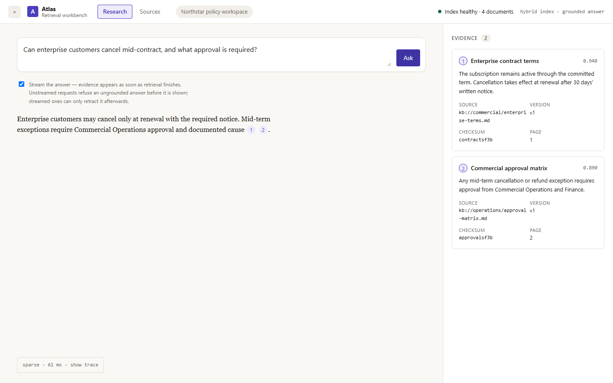
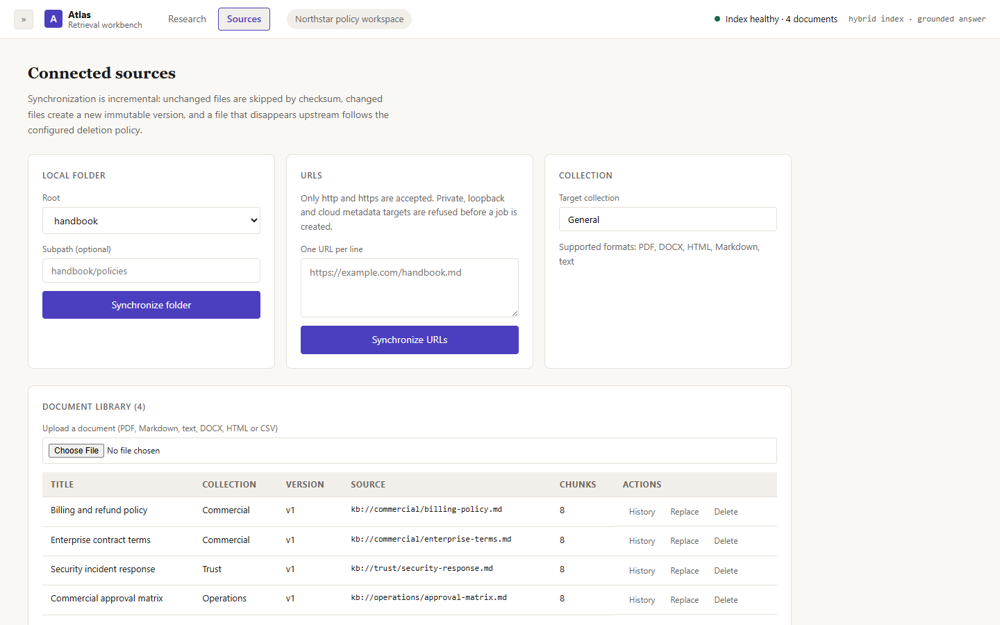

# Atlas Knowledge

**Verification:** [claim-to-artifact map and rerun commands](https://sutasmantas.github.io/evidence/#atlas) · [machine-readable receipt](https://sutasmantas.github.io/evidence/receipt.json)

[](https://github.com/sutasmantas/grounded-knowledge-assistant/actions/workflows/ci.yml)
[](pyproject.toml)
[](LICENSE)

**Compare dense, sparse, hybrid and reranked retrieval while inspecting every passage
behind the answer.**

Atlas is a reusable RAG workbench for building and comparing grounded answer
systems. It ingests PDF, Markdown, text, DOCX, HTML, URL and CSV sources into
named dense and sparse Qdrant indexes, supports
collection filters, fuses semantic and lexical candidates, optionally reranks
them with a local cross-encoder, and exposes the retrieval trace beside the
cited answer. A deterministic local mode runs without credentials.



## Try the working system

[Open the live research workspace](https://sutasmantas.github.io/grounded-knowledge-assistant/)

[](https://codespaces.new/sutasmantas/grounded-knowledge-assistant?quickstart=1)
[](https://render.com/deploy?repo=https://github.com/sutasmantas/grounded-knowledge-assistant)

The Codespace installs the project, uses deterministic offline retrieval, starts
the API, and opens the web interface on port 8000. Six fictional policy
documents are already indexed, so ask:

> Can enterprise customers cancel mid-contract, and what approval is required?

The Render blueprint uses the same no-key mode. Render's free services can take
time to wake and their local filesystem is ephemeral; use Docker or a persistent
disk for durable uploads.

<details>
<summary>See the document library</summary>



</details>

## What is implemented

- a replaceable parser registry for PDF, Markdown, text, DOCX, HTML, URL content, and CSV
- measured parser routing: pypdf for ordinary text PDFs, Docling for scanned, DOCX and structured HTML
- local-folder and URL connectors behind one discover/fetch/describe contract
- connector synchronization with stable source IDs, checksum skipping, immutable
  versions, a documented archive/delete policy, and idempotent repeat runs
- connector security boundaries: configured roots only, no traversal or symlink
  escape, http/https only, no embedded credentials, blocked private and cloud
  metadata targets, revalidated redirects, bounded size and timeouts
- immutable source IDs, checksums, source URIs, and document version history
- replacement/re-indexing that retires stale vectors before the new version is searchable
- durable asynchronous ingestion jobs with progress, cancellation, retry, and dead-letter states
- tenant-scoped metadata, vector search, and duplicate detection
- tenant-and-owner-scoped ingestion idempotency keys
- tenant-visible or restricted document ACLs for principals and groups
- owner-only replacement, deletion, and ingestion-job controls
- correlated JSON request logs and OpenTelemetry spans across RAG and ingestion
- optional pinned Phoenix trace viewer through a Docker Compose overlay
- deterministic direct/indirect prompt-injection checks and source risk flags
- named dense and sparse Qdrant indexes with reciprocal-rank fusion
- selectable `dense`, `sparse`, `hybrid`, and `hybrid-reranked` query profiles
- optional local BGE cross-encoder and ColBERT reranking through FastEmbed
- configurable chunking, candidate limits, score gates, and collection filters
- persistent Qdrant indexes plus SQLite document metadata
- source-ranked answers with inline citations and inspectable passages
- an execution trace with profile, fusion, candidate count, and stage latency
- a generation trace with provider, context size, stage latency, and provider-reported
  token use that is never estimated when the provider does not report it
- a versioned golden set and command-line profile comparison
- a no-key deterministic mode for tests and regression checks
- FastEmbed semantic embeddings using `BAAI/bge-small-en-v1.5`
- optional OpenAI-compatible answer generation
- upload, search, query, and delete flows in the browser
- typed FastAPI endpoints, automated tests, Docker, and GitHub Actions

The seeded documents are fictional. Uploaded files are processed in a temporary
directory and are not retained after indexing.

## Run locally

Requirements: Python 3.11 and Node.js 22.

```bash
python -m venv .venv
```

Activate the environment, then:

```bash
python -m pip install -e ".[dev]"
cd frontend
npm ci
npm run build
cd ..
uvicorn app.main:app --reload
```

Open <http://localhost:8000>. Interactive API documentation is available at
<http://localhost:8000/docs>.

The production build is served by FastAPI from `frontend/dist`. For frontend
development, keep the API on port 8000 and run `npm run dev` in `frontend`; the
Vite server at <http://localhost:5273> proxies `/api` to the real backend. A
backend-only editable checkout that has not run `npm run build` deliberately
falls back to the previous static shell so Python tests and API work do not
require Node.

The default answer generator is local and extractive, so it needs no API key.
FastEmbed downloads `BAAI/bge-small-en-v1.5` on first launch and then uses the
local model cache.

The optional embedding comparison adds the much larger BGE-M3 model:

```bash
python -m pip install -e ".[embedding-benchmark]"
```

## Lightweight offline retrieval

To skip the embedding-model download, copy `.env.example` to `.env` and set:

```dotenv
ATLAS_EMBEDDING_PROVIDER=hash
```

Hash mode is deterministic and useful for development and tests, but provides
lexical rather than semantic similarity. Remove `data/runtime` before switching
embedding providers so vectors are rebuilt with the matching representation.

## Retrieval profiles

The request can select a profile without rebuilding the index:

| Profile | Pipeline | Best use |
| --- | --- | --- |
| `dense` | dense nearest-neighbor search | semantic baseline |
| `sparse` | hashed lexical vectors with collection-level IDF | exact terms, identifiers, and lexical baseline |
| `hybrid` | dense + hashed lexical vectors + RRF | mixed semantic and identifier-heavy corpora when evaluation justifies the extra work |
| `hybrid-reranked` | hybrid candidate set + configured reranker | quality-focused queries where added latency is acceptable |

Sparse is the measured default for the bundled policy corpus. The configured
reranker is `BAAI/bge-reranker-base`. It is loaded only when a
reranked query is requested. The committed bake-off keeps this as a
high-latency experiment, not a recommendation for interactive queries. Set
`ATLAS_RERANKER_PROVIDER=lexical` for a small deterministic fallback.

## Use an OpenAI-compatible model

Set these values in `.env`:

```dotenv
ATLAS_GENERATION_PROVIDER=openai-compatible
ATLAS_LLM_BASE_URL=https://your-provider.example/v1
ATLAS_LLM_API_KEY=your-key
ATLAS_LLM_MODEL=your-model
ATLAS_LLM_MAX_TOKENS=256
```

Only the question and retrieved passages are sent to the configured endpoint.
The application rejects generated answers that do not contain source citations.
Secrets and runtime data are excluded from Git.

## Docker

```bash
docker compose up --build
```

The default stack uses embedded Qdrant. To run the same lifecycle and ACL
implementation against a persisted Qdrant server:

```bash
docker compose -f docker-compose.yml -f docker-compose.qdrant.yml up --build
```

See the [server-mode contract and evidence](docs/qdrant-server.md), including
required filter indexes, restart/failure behavior, and the explicit no-migration
boundary between embedded and server data.

The Docker image persists SQLite and Qdrant data in the `atlas-data` volume.

Run the same application with a local OpenTelemetry/Phoenix trace viewer:

```bash
docker compose \
  -f docker-compose.yml \
  -f docker-compose.observability.yml \
  up --build
```

Phoenix opens on <http://localhost:6006>. See
[docs/observability.md](docs/observability.md) for the emitted spans, data
minimization boundary, collector configuration, and security limitations.

## Try these questions

- `Can enterprise customers cancel mid-contract, and what approval is required?`
- `When is an unused annual plan eligible for a refund?`
- `What process applies after a serious security incident affects a contract?`

You can also disable collections in the sidebar to see how retrieval scope
changes the result.

## API

| Method | Endpoint | Purpose |
| --- | --- | --- |
| `GET` | `/api/health` | Provider modes and index status |
| `GET` | `/api/health/live` | Process liveness |
| `GET` | `/api/health/ready` | SQLite, job store, and vector-index readiness |
| `GET` | `/api/documents` | List indexed documents |
| `GET` | `/api/documents/{id}/versions` | Read immutable version history for a source |
| `POST` | `/api/documents` | Extract, chunk, embed, and index a file |
| `PUT` | `/api/documents/{id}` | Replace the current document with a new immutable version |
| `DELETE` | `/api/documents/{id}` | Remove every version and vector for the source |
| `GET` | `/api/connectors` | List connectors, configured root names, and supported formats |
| `POST` | `/api/connectors/local-folder/sync` | Queue a folder synchronization job |
| `POST` | `/api/connectors/url/sync` | Queue a URL synchronization job |
| `POST` | `/api/ingestion-jobs` | Persist an upload and return a queued job |
| `GET` | `/api/ingestion-jobs` | List recent ingestion jobs |
| `GET` | `/api/ingestion-jobs/{id}` | Read progress, attempts, errors, and result ID |
| `POST` | `/api/ingestion-jobs/{id}/cancel` | Cancel queued or cooperatively stop running work |
| `POST` | `/api/ingestion-jobs/{id}/retry` | Retry a transient failure within its attempt budget |
| `POST` | `/api/ingestion-jobs/{id}/replay` | Explicitly replay a dead-letter job |
| `POST` | `/api/query` | Retrieve passages and generate a cited answer |
| `POST` | `/api/evaluations/compare` | Run the same question through two to four retrieval profiles |

Uploads accept an optional `source_uri` form field. A replacement keeps the
stable `source_id`, increments `version`, records `supersedes_document_id`, and
marks the prior metadata row as `superseded`. Retrieval excludes retired
vectors before ranking. Every returned passage identifies the exact source URI,
document version, and SHA-256 checksum used for the answer.

### Connector synchronization

Configure the folders a connector may ever read, by name:

```bash
export ATLAS_CONNECTOR_LOCAL_ROOTS='{"handbook": "/srv/atlas/handbook"}'
```

```bash
curl -X POST localhost:8000/api/connectors/local-folder/sync \
  -H 'Content-Type: application/json' -H 'Idempotency-Key: handbook-nightly' \
  -d '{"root": "handbook", "collection": "Operations"}'
```

The response is a queued job. `GET /api/ingestion-jobs/{id}` returns its
progress and, once finished, a `sync_report` counting created, updated,
unchanged, removed, skipped, and failed items with a per-item breakdown. A
repeated run over unchanged content performs no vector work. Changed content
creates a new immutable version and retires the previous vectors. An item that
disappears upstream follows `ATLAS_CONNECTOR_DELETION_POLICY`.

URL synchronization takes an explicit list and rejects unsafe targets before a
job is created:

```bash
curl -X POST localhost:8000/api/connectors/url/sync \
  -H 'Content-Type: application/json' \
  -d '{"urls": ["https://example.com/handbook.md"], "instance_id": "handbook-mirror"}'
```

The [connector reference](docs/connectors.md) documents the parser routing
table, the SSRF controls, and the deletion policy.

### Authentication, tenant and ACL contract

Atlas has two authentication modes. The default `headers` mode accepts
`X-Atlas-Tenant`, `X-Atlas-Principal`, and optional comma-separated
`X-Atlas-Groups` headers from a trusted gateway. With no headers, the local
browser starts in the seeded `demo` workspace as `demo-user`.

Set `ATLAS_AUTH_MODE=oidc` at the public edge: data APIs then accept bearer
tokens only, validate
their signature and standard claims against the configured JWKS, and ignore
all caller-supplied identity headers. Tenant, principal, group, and role claim
names are configurable; groups and roles both map into the existing ACL group
set only after verification. Liveness and readiness stay public for platform
probes. See the [OIDC deployment contract](docs/oidc-authentication.md).

Uploads in either mode accept `visibility` (`tenant` or `restricted`) plus
comma-separated `allowed_principals` and `allowed_groups` form fields.

Tenant and ACL predicates are applied to Qdrant before dense or sparse
retrieval. SQLite reads also require the tenant and ACL, while replacement,
deletion, and job controls require the owning principal. Unauthorized direct
IDs return 404 to avoid confirming whether a resource exists.

The asynchronous endpoint accepts the same multipart fields and an optional
`Idempotency-Key` header. Job state is stored in SQLite independently of the
request, while the uploaded input is retained only until success or
cancellation. Interrupted running jobs return to the queue at startup unless
their attempt budget is exhausted.

The bundled worker needs no Redis or broker. Multi-worker deployments can keep
the API and job schema while replacing the runner with RQ, Celery, or a durable
workflow platform:
https://fastapi.tiangolo.com/tutorial/background-tasks/

Example query:

```bash
curl -X POST http://localhost:8000/api/query \
  -H "Content-Type: application/json" \
  -d '{"question":"Who approves a commercial exception below 50,000 USD?","collections":["Customer contracts"]}'
```

## Retrieval evaluation

The frozen evaluation corpus lives in
[`evals/golden.jsonl`](evals/golden.jsonl). It contains 56 reviewed cases:
50 runnable retrieval cases and six explicit capability gates for document
versions, prompt injection, and tenant isolation. Cases are labeled by
category and split into development and held-out sets.

Run the fast, deterministic comparison and retain both aggregate and per-case
evidence:

```bash
python -m app.evaluation \
  --profiles dense sparse hybrid hybrid-reranked \
  --output artifacts/baseline.json \
  --raw-output artifacts/baseline-cases.jsonl
```

Run the semantic and cross-encoder providers used by the full local setup:

```bash
python -m app.evaluation \
  --embedding-provider fastembed \
  --reranker-provider cross-encoder \
  --profiles dense sparse hybrid hybrid-reranked
```

Use `--split development` while tuning and `--split held_out` for the final
comparison. The runner records MRR@5, Recall@5, nDCG@5, abstention accuracy,
p50/p95 latency, index time, traced Python peak memory, dataset hashes, and raw
per-case outcomes. The committed
[deterministic baseline](docs/evaluation-deterministic-baseline-v3.json),
[semantic baseline](docs/evaluation-semantic-baseline-v3.json), and
[decision report](docs/evaluation-report.md) make the quality/latency tradeoff
inspectable.

The result is a regression gate on a small fictional corpus, not a quality
claim for arbitrary client documents. Replace the corpus with representative
client questions and expected sources before selecting a production profile.

### Parser bake-off

Atlas also includes a reproducible PDF parser comparison using four upstream
document/reference pairs. The normal application keeps its lightweight
dependency set; the larger parser stack is an experiment-only extra.

```bash
pip install -e ".[parsing-benchmark]"
python -m app.parsing_benchmark \
  --output artifacts/parsing.json \
  --artifacts-dir artifacts/parsing-output
```

The committed [parser decision report](docs/parsing-bakeoff.md), raw
[benchmark result](docs/parsing-benchmark-v2.json), and
[extracted Markdown](docs/parsing-artifacts-v2) make the tradeoff inspectable.
The seven-fixture comparison covers normal and scanned PDFs, DOCX, and HTML.
The measured decision is a fast `pypdf` path for ordinary text PDFs and an
asynchronous Docling quality path for scanned, layout-heavy, and structured
office/web documents. Unstructured-fast retained text but flattened the tested
DOCX and HTML tables.

### Chunking bake-off

Fixed windows, heading-aware chunks, parent-child retrieval, and Docling's
tokenizer-aware `HybridChunker` are compared on the same 50 frozen cases. The
runner can isolate sparse retrieval or use dense+sparse hybrid retrieval:

```bash
python -m app.chunking_benchmark \
  --embedding-provider fastembed \
  --retrieval-profile hybrid \
  --output artifacts/chunking.json \
  --raw-output artifacts/chunking-cases.jsonl
```

The committed [chunking decision report](docs/chunking-bakeoff.md) links the
sparse and hybrid aggregate results and every per-case outcome. Fixed chunking
remains the default because it is the only method with complete held-out source
recall in both runs; Docling hybrid was also roughly an order of magnitude
slower to index this corpus. Set `ATLAS_CHUNKING_PROFILE` to `heading-aware`,
`parent-child`, or `docling-hybrid` before ingestion to reproduce an
alternative. `docling-hybrid` requires the `parsing-benchmark` extra. Rebuild
an existing index after changing the profile; the setting does not rewrite
already indexed documents.

### Embedding bake-off

The embedding runner holds the fixed chunker, frozen questions, retrieval
settings, generator, and reranker constant while comparing BGE small and
BGE-M3 locally. It also defines a credential-gated, 1,024-dimension
`text-embedding-3-large` run:

```bash
python -m app.embedding_benchmark \
  --output artifacts/embedding.json \
  --raw-output artifacts/embedding-cases.jsonl
```

Set `ATLAS_EMBEDDING_API_KEY` to execute the hosted candidate. Without a key,
the report records `credential_required` and no quality or cost result. The
committed [embedding decision report](docs/embedding-bakeoff.md),
[aggregate result](docs/embedding-benchmark-v1.json), and
[per-case evidence](docs/embedding-benchmark-v1-cases.jsonl) explain why BGE
small remains the local default while BGE-M3 remains selectable for
multilingual or longer-document client work.

### Answer and citation evaluation

The release evaluator runs the held-out split through the measured sparse
profile, validates every citation rank and extractive span, and uses the pinned
open HHEM model to score each claim against its cited passage:

```bash
python -m pip install -e ".[semantic-eval]"
python -m app.semantic_evaluation \
  --output artifacts/semantic-evaluation.json \
  --raw-output artifacts/semantic-evaluation-cases.jsonl
```

The evaluator needs no API key. Supported and deliberately unsupported control
pairs must separate correctly before the gate can pass. See the committed
[semantic evaluation report](docs/semantic-evaluation.md),
[aggregate artifact](docs/semantic-evaluation-v1.json),
[raw case records](docs/semantic-evaluation-v1-cases.jsonl), and
[profile winner matrix](docs/profile-winner-matrix.md). Citation faithfulness
passes; the report also preserves the held-out abstention failure instead of
hiding it inside the aggregate score.

### Generation-provider comparison

The P2 runner compares extractive generation with a real local or hosted
OpenAI-compatible provider on those same held-out cases. It records citation
support, abstention, per-category failures, latency, provider tokens, cost, and
an external resource snapshot:

```bash
python -m app.generation_evaluation \
  --candidate-base-url http://127.0.0.1:18080/v1 \
  --candidate-model gemma-3-1b-it \
  --resource docs/atlas-p2-generation-resources.json \
  --output artifacts/generation-comparison.json \
  --raw-output artifacts/generation-comparison-cases.jsonl
```

The committed [decision](docs/generation-comparison.md) and
[aggregate artifact](docs/atlas-p2-generation-comparison.json) reject the
measured 1B local candidate and keep extractive as the default. Evaluation may
capture uncited output for diagnosis; production continues to reject it.

### Reranker bake-off

The reranker runner holds the fixed chunker, BGE small embeddings, hybrid
candidates, and frozen cases constant while comparing no reranker, MiniLM,
BGE, and ColBERT:

```bash
python -m app.reranker_benchmark \
  --output artifacts/reranker.json \
  --raw-output artifacts/reranker-cases.jsonl
```

The [decision report](docs/reranker-bakeoff.md),
[aggregate result](docs/reranker-semantic.json), and
[per-case outcomes](docs/reranker-semantic-cases.jsonl) retain both gains and
regressions. No learned reranker passed the interactive-default gate.

## Quality checks

```bash
ruff check .
pytest --cov=app --cov-report=term-missing
```

CI runs both commands on every push and pull request. Tests cover all retrieval
profiles, trace output, abstention, collection filtering, document upload and
persistence, immutable replacement history, stale-vector exclusion, duplicate
detection, deletion, invalid file handling, durable job recovery, idempotent
submission, cooperative cancellation, retry, and dead-letter replay.
The authorization suite also covers real RSA/JWKS validation and key rotation,
invalid signature/issuer/audience/expiry rejection, spoofed-header rejection,
cross-tenant canary retrieval, role/group ACLs, tenant-scoped hashes and
idempotency, and unauthorized direct object requests.
Security regressions also cover correlation IDs, response headers, declared
body limits, structured-log redaction, direct prompt overrides, indirect source
instructions, and remote-resource output markup.
Evaluation tests cover typed side-by-side profile comparison, citation
validity/completeness, exact passage support, and semantic-judge controls.

## Architecture

The application deliberately keeps the retrieval pipeline visible:

```text
file -> extraction -> chunking -> dense + sparse vectors -> Qdrant
                                                     |
question -> dense + lexical retrieval -> RRF -> optional rerank
                                             |
                                  evidence trace -> cited answer
                                             |
                                  SQLite document metadata
```

See [docs/architecture.md](docs/architecture.md) for data boundaries, provider
modes, and explicit non-goals.

## License

MIT
